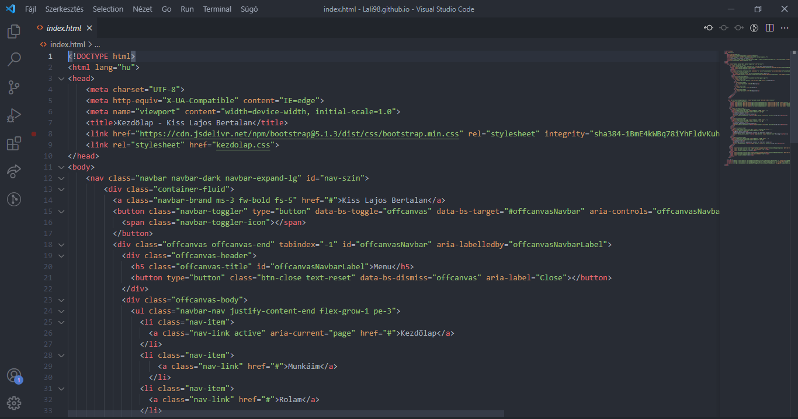
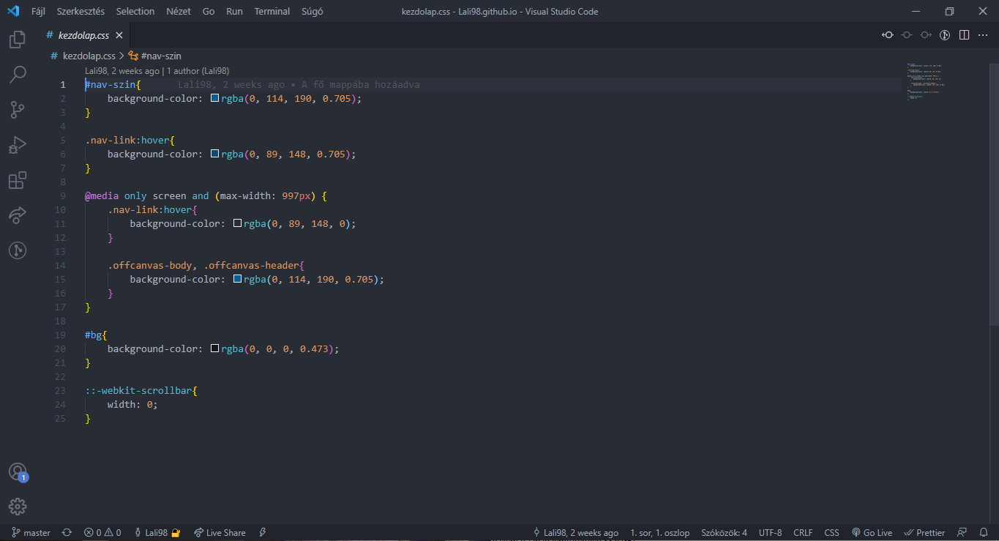

# Lukcy Kávézó

## Téma és feladat leirás
Egy kávézó weboldalát felújitani volt a feladat. A Lucky kávézó projektet csapatmunkában dolgoztuk fel. A feladat elkészítéséhez projekt menedzsert választottunk, majd az elkészítéshez létrehoztunk egy TRELLO táblát, ahol mindenki megtudta osztani a saját ötleteit, elképzelését. A szabad felhasználású képeket letöltés után egyforma méretre formáztuk. Mindeközben minden információt megosztottunk a Trello táblán. A projektmenedzser folyamatosan figyelte, hogy ne maradjon ki feladat. A feladatok a tagokra nem voltak terhelve, hisz az elején mindenki megkapta a saját feladatát. Majd végül az elkészült Wireframe szabványnak és az egységes menürendszernek megfelelő oldalt szintén validáltuk, ha minden rendben volt, akkor a feladatok késznek tekintettük.

## Részvevők
- Kiss Lajos Bertalan (HTML, CSS)
- Nagy Tibor (HTML, CSS)
- Kolozsvári Krisztián (Források gyüjtése)

## Kodsor
### HTML

### CSS

## Weboldalrol

[Weboldal](https://lali98.github.io/lukcy_kavezo/)
